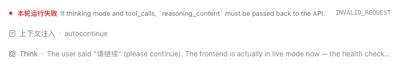
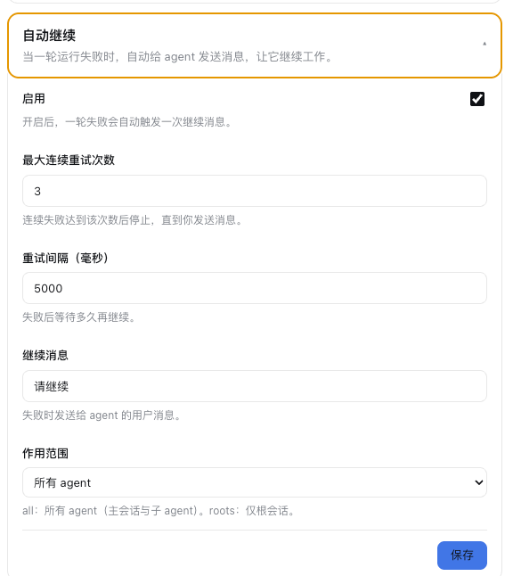

# dsh-plugin-autocontinue

DSH（DeepSeek Harness）插件：当 agent 一轮运行失败（UI 显示 **"本轮运行失败"**）时，自动向该 agent 发送一条"请继续"消息，让它进入新的一轮继续工作，减少需要人工干预的失败。



## 工作原理

- **失败信号**：监听 `session/event` 中的 `turn/end` 事件，当 `reason.kind === "error"` 时判定为本轮失败——这正是 UI 渲染"本轮运行失败"的同一个事件。
- **自动继续**：确认 agent 回到 idle 后，调用 `agent.followup()`（与内置 `dsh-tool-jobs` 唤醒 agent 相同的机制）发送一条用户消息，agent 随即开始新的一轮。
- **与 llm-retry 的关系**：`dsh-llm-retry` 只处理 LLM 请求层错误；本插件处理的是 turn 层失败（工具调用、断言等其他异常），两者互补。

## 防循环保护

- 每个 agent 独立计数**连续失败次数**；达到 `maxRetries` 后停止自动继续。
- 任意一轮成功、或用户主动发消息后，计数清零，自动继续能力重新武装。
- 每轮失败只触发一次继续，绝不重入。

## 安装

> ⚠️ 本插件尚未发布到 npm registry。以下两种方式皆可安装，并不需要发布。

### 方式 A：从本地路径安装（推荐）

```bash
cd ~/.dsh/profiles/desktop
pnpm add file:/path/to/dsh-plugin-autocontinue
```

### 方式 B：从 GitHub 安装

```bash
cd ~/.dsh/profiles/desktop
pnpm add github:swizardlv/dsh-plugin-autocontinue
```

### 安装后的公共步骤

1. 编辑 `~/.dsh/profiles/desktop/package.json`，在 `dsh.profile.bundles` 数组追加：

   ```json
   "dsh-plugin-autocontinue"
   ```

2. 重启桌面 app 生效。

### 关于 peer 依赖

插件声明了 `peerDependencies` 指向 `@deepseek-ai/dsh-llm`、`@deepseek-ai/dsh-settings` 等 DSH 内部包。这些包**不在** profile 的 `node_modules` 里——它们由 DSH 桌面 app 自身提供。`pnpm install` 时可能报 peer 缺失警告（warning），**无害**：DSH 运行时有自定义模块解析器（`installProfilePackageResolver`），会自动从 app 安装位置解析这些包。不需手动安装 peer。

### 可选：注入默认配置

在 `~/.dsh/profiles/desktop/cordis.patch.yml` 中按需覆盖默认值（不写则全部使用默认值）：

```yaml
- id: autocontinue
  name: dsh-plugin-autocontinue
  config:
    enabled: true
    maxRetries: 3
    delayMs: 5000
    message: 请继续
    scope: all
```

## 配置

插件在 GUI 的设置 → 插件配置 中提供一张 **"自动继续"** 卡片，修改即时生效（无需重启）；也可通过上方 cordis.patch.yml 注入。



| 配置项 | 类型 | 默认值 | 说明 |
|---|---|---|---|
| `enabled` | boolean | `true` | 总开关 |
| `maxRetries` | number | `3` | 单 agent 连续失败最多自动继续次数 |
| `delayMs` | number | `5000` | 失败后延迟多久再继续（给 agent 留出回到 idle 的时间） |
| `message` | string | `"请继续"` | 发送给 agent 的消息文本 |
| `scope` | `all` / `roots` | `"all"` | `all` 覆盖所有 agent；`roots` 仅根会话 |

## 开发

仓库布局：

```
├── package.json          # exports "." (host) + "./client" (browser)；dsh.client 声明
├── lib/
│   ├── index.js          # Host 半区：核心自动继续逻辑（Node 进程）
│   └── client.js         # Client 半区：设置面板卡片（浏览器）
└── docs/superpowers/specs/2026-01-27-autocontinue-plugin-design.md
```

> 注：Client 半区依赖 `dsh-client-modules` 扫描 `dsh.client` 声明注入浏览器；若 GUI 中未出现设置卡片，可能需要重建 Web 产物（见 DSH 的 `pnpm run dev:web` 流程）。

## 验证

制造一次 turn 失败（如临时让某个工具抛错），观察会话日志：
1. 出现 `turn/end` + error 事件（UI 显示"本轮运行失败"）。
2. 约 `delayMs` 后，会话中自动出现发送的"请继续"用户消息，随后新的 `turn/start` 开始。
3. 连续失败达到 `maxRetries` 后不再自动继续；用户发消息后恢复。

## License

[Apache License 2.0](LICENSE)
